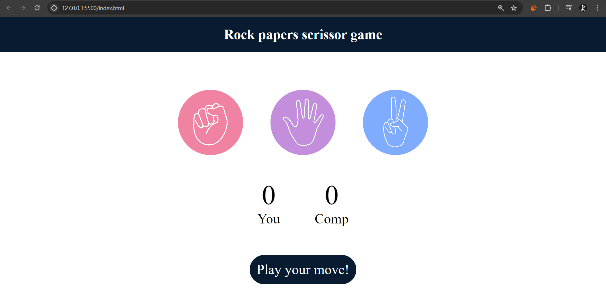
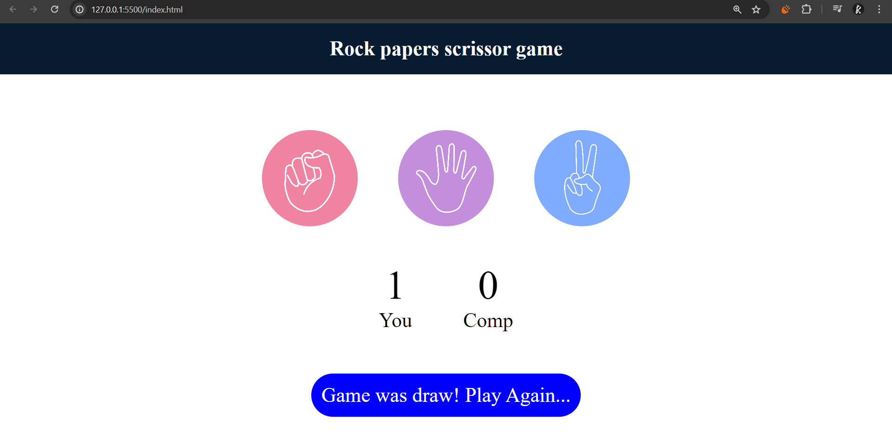
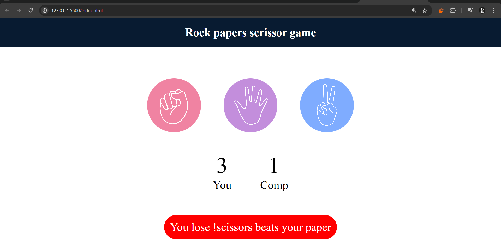

# Rock Paper Scissors Game

This is a simple Rock Paper Scissors game built using HTML, CSS, and JavaScript.

## Table of Contents
- [Description](#description)
- [How to Play](#how-to-play)
- [Screenshots](#screenshots)
- [Installation](#installation)
- [Usage](#usage)
- [License](#license)

## Description
The Rock Paper Scissors game is a classic hand game that is often played as a simple decision-making tool. This project is an implementation of the game in a web environment using HTML, CSS, and JavaScript. The user can choose between rock, paper, and scissors, and the computer will randomly select a choice. The winner is then determined based on the classic rules of the game.

## How to Play
1. Open the game in a web browser.
2. Click on either the rock, paper, or scissors image to make your choice.
3. The computer will make a random choice.
4. The result will be displayed, showing whether you won, lost, or if it was a draw.
5. The scores will be updated accordingly.

## Screenshots
### Game Start


### Player Wins


### Game Draw


## Installation
To play the game locally, follow these steps:
1. Clone the repository:
    ```bash
    git clone https://github.com/kiran94486/Web_dev.git
    ```
2. Navigate to the project directory:
    ```bash
    cd Web_dev
    ```
3. Open `index.html` in your favorite web browser.

## Usage
Simply open the `index.html` file in a web browser to start playing the game.

## License
This project is free any one use this code ! Happy coding :>
